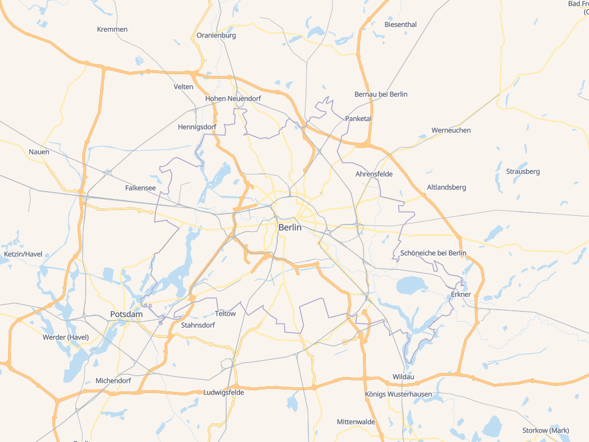
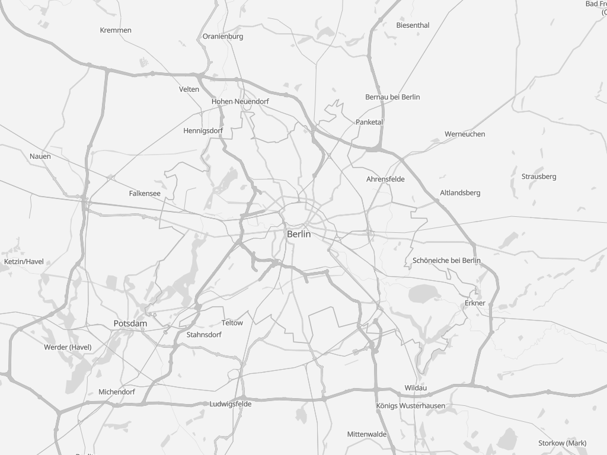
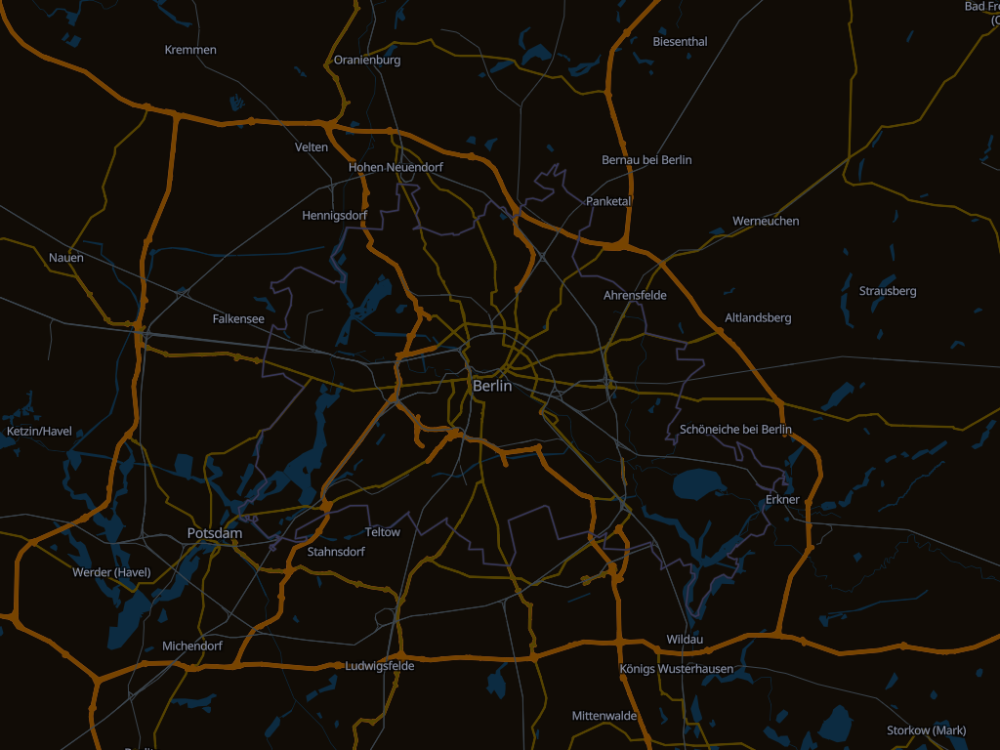
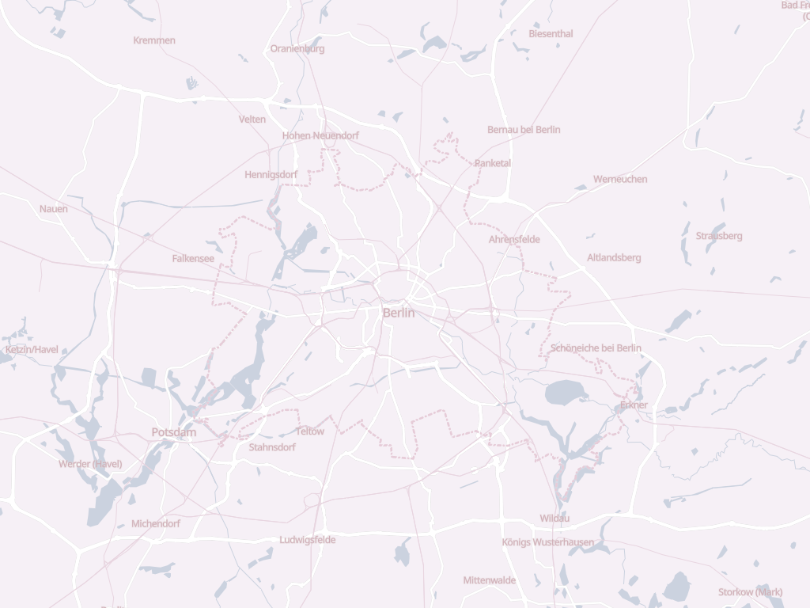

[](https://www.npmjs.com/package/@versatiles/style)
[](https://codecov.io/gh/versatiles-org/versatiles-style)
[](https://github.com/versatiles-org/versatiles-style/actions/workflows/ci.yml)
[](https://github.com/versatiles-org/versatiles-style/releases/latest)

# VersaTiles Style

**VersaTiles Style** generates styles and sprites for MapLibre.

---

## Styles Overview

| Style Name    | Preview                                                                   |
|---------------|---------------------------------------------------------------------------|
| **colorful**  |    |
| **graybeard** |  |
| **eclipse**   |      |
| **neutrino**  |    |

---

## Using VersaTiles Styles

### Prebuilt Styles and Sprites

Download the assets from the [latest release](https://github.com/versatiles-org/versatiles-style/releases/latest/):

- **[styles.tar.gz](https://github.com/versatiles-org/versatiles-style/releases/latest/download/styles.tar.gz):** Contains all styles in multiple languages.
  - **Note:** These styles use `tiles.versatiles.org` as the source for tiles, fonts (glyphs), and icons (sprites).
- **[sprites.tar.gz](https://github.com/versatiles-org/versatiles-style/releases/latest/download/sprites.tar.gz):** Includes map icons and other sprites.
- **[versatiles-style.tar.gz](https://github.com/versatiles-org/versatiles-style/releases/latest/download/versatiles-style.tar.gz):** Contains a JavaScript file to generate styles dynamically in the browser.

---

## Generating Styles On-the-Fly

### Frontend Usage (Web Browser)

Download the latest release:

```bash
curl -Ls "https://github.com/versatiles-org/versatiles-style/releases/latest/download/versatiles-style.tar.gz" | gzip -d | tar -xf -
```

Integrate it into your HTML application:

```html
<div id="map"></div>
<script src="maplibre-gl.js"></script>
<script src="versatiles-style.js"></script>
<script>
   const style = VersaTilesStyle.graybeard({
      language: 'de',
      colors: { label: '#222' },
      recolor: { gamma: 0.5 }
   });

   const map = new maplibregl.Map({
      container: 'map',
      style
   });
</script>
```

### Backend Usage (Node.js)

Install the library via NPM:

```bash
npm install @versatiles/style
```

Generate styles programmatically:

```javascript
import { colorful } from '@versatiles/style';
import { writeFileSync } from 'node:fs';

const style = colorful({
  language: 'en',
});
writeFileSync('style.json', JSON.stringify(style));
```

---

## Style Generation Methods

The library offers the following style generation methods:

- `colorful(options)` - [Documentation](https://github.com/versatiles-org/versatiles-style/blob/main/docs/functions/colorful.md)
- `eclipse(options)` - [Documentation](https://github.com/versatiles-org/versatiles-style/blob/main/docs/functions/eclipse.md)
- `graybeard(options)` - [Documentation](https://github.com/versatiles-org/versatiles-style/blob/main/docs/functions/graybeard.md)
- `neutrino(options)` - [Documentation](https://github.com/versatiles-org/versatiles-style/blob/main/docs/functions/neutrino.md)

**`options`**: An optional object to customize the styles. [Learn more](https://github.com/versatiles-org/versatiles-style/blob/main/docs/interfaces/StyleBuilderOptions.md)

### Guess Style Method

```javascript
const style = guessStyle(options);
```
[Documentation](https://github.com/versatiles-org/versatiles-style/blob/main/docs/functions/guessStyle.md)

---

## Build Instructions

### Prerequisites

To build new sprites, ensure `optipng` is installed.

### SVG Source Requirements

- SVGs must consist only of paths and should not contain any `transform()` attributes.
- Styles and colors within the SVG are ignored.
- All length values must be specified in pixels without units.

### Configuration

Define icon sets in the configuration file: [`scripts/config-sprites.ts`](./scripts/config-sprites.ts)

---

## Development

Run the project in development mode:

```bash
npm run dev
```

A local server will be available at [http://localhost:8080](http://localhost:8080). Use it to select a style, edit definitions in `src/styles/...`, and reload the page to view the changes.

---

## Licenses

- **Source Code:** [Unlicense](./LICENSE.md)
- **Iconsets and Rendered Spritemaps:** [CC0 1.0 Universal](./icons/LICENSE.md)

