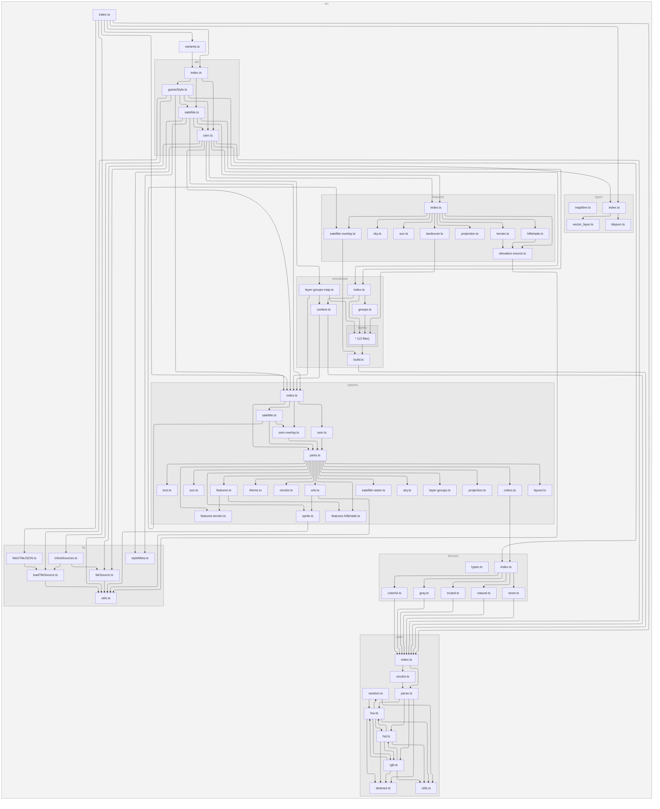

[](https://www.npmjs.com/package/@versatiles/style)
[](https://github.com/versatiles-org/versatiles-style/releases/latest)
[](https://codecov.io/gh/versatiles-org/versatiles-style)
[](https://github.com/versatiles-org/versatiles-style/actions/workflows/ci.yml)
[](LICENSE)

# VersaTiles Style

**VersaTiles Style** generates styles and sprites for MapLibre.

---

## Styles Overview

The `osm()` function renders OpenStreetMap vector tiles using one of five built-in color palettes,
each available in light and dark mode. `satellite()` renders raster/satellite tiles with an optional
vector overlay.

| Palette       | Preview                                                                                               |
| ------------- | ----------------------------------------------------------------------------------------------------- |
| **colorful**  |    |
| **natural**   |      |
| **muted**     |          |
| **gray**      |            |
| **toner**     |          |
| **satellite** |  |

---

## Using VersaTiles Styles

### Prebuilt Styles and Sprites

Download the assets from the [latest release](https://github.com/versatiles-org/versatiles-style/releases/latest/):

- **[styles.tar.gz](https://github.com/versatiles-org/versatiles-style/releases/latest/download/styles.tar.gz):** Contains all styles in multiple languages.
  - **Note:** These styles use `tiles.versatiles.org` as the source for tiles, fonts (glyphs), and icons (sprites).
- **[sprites.tar.gz](https://github.com/versatiles-org/versatiles-style/releases/latest/download/sprites.tar.gz):** Includes map icons and other sprites.
- **[versatiles-style.tar.gz](https://github.com/versatiles-org/versatiles-style/releases/latest/download/versatiles-style.tar.gz):** Contains a JavaScript file to generate styles dynamically in the browser.

---

## Generating Styles On-the-Fly

### Frontend Usage (Web Browser)

Download the latest release:

```bash
curl -Ls "https://github.com/versatiles-org/versatiles-style/releases/latest/download/versatiles-style.tar.gz" | gzip -d | tar -xf -
```

Integrate it into your HTML application:

```html
<div id="map"></div>
<script src="maplibre-gl.js"></script>
<script src="versatiles-style.js"></script>
<script>
  const style = VersaTilesStyle.osm({
    theme: { palette: 'colorful', darkMode: true },
    text: { language: 'de' },
    recolor: { gamma: 0.5 },
  });

  const map = new maplibregl.Map({
    container: 'map',
    style,
  });
</script>
```

> **Requires MapLibre GL JS 5.0 or newer.**
> The generated styles set the [`globe` projection](https://maplibre.org/maplibre-style-spec/projection/)
> and a root [`sky`](https://maplibre.org/maplibre-style-spec/sky/). Older versions ignore both and
> render a flat Mercator map with no sky — everything else works, so this degrades rather than breaks.
>
> npm users have this checked automatically through an optional peer dependency. Loading MapLibre
> from a `<script>` tag, as above, bypasses that check entirely — so verify the version yourself.
> To stay on Mercator deliberately, pass `projection: 'mercator'`.

### Backend Usage (Node.js)

Install the library via NPM:

```bash
npm install @versatiles/style
```

Generate styles programmatically:

```javascript
import { osm } from '@versatiles/style';
import { writeFileSync } from 'node:fs';

const style = osm({
  theme: 'colorful',
  text: { language: 'en' },
});
writeFileSync('style.json', JSON.stringify(style));
```

---

## Style Generation Methods

All three functions are synchronous and return a MapLibre `StyleSpecification`:

- `osm(options)` - OpenStreetMap vector style. [Documentation](https://versatiles.org/versatiles-style/functions/osm.html)
  - `theme`: a palette name (`'colorful' | 'natural' | 'muted' | 'gray' | 'toner'`) or `{ palette, darkMode }`.
  - `text`, `colors`, `recolor`, `layers`, `features`, `urls`: see [OsmOptions](https://versatiles.org/versatiles-style/interfaces/OsmOptions.html).
- `satellite(options)` - raster/satellite style with an optional OSM overlay. [Documentation](https://versatiles.org/versatiles-style/functions/satellite.html) — see [SatelliteOptions](https://versatiles.org/versatiles-style/interfaces/SatelliteOptions.html).
- `guessStyle(tileJSON)` - inspect a TileJSON and return the most appropriate style. [Documentation](https://versatiles.org/versatiles-style/functions/guessStyle.html)

```javascript
import { guessStyle } from '@versatiles/style';
const style = guessStyle(tileJSON);
```

---

## Build Instructions

### Prerequisites

To build new sprites, ensure `optipng` is installed.

### SVG Source Requirements

- SVGs must consist only of paths and should not contain any `transform()` attributes.
- Styles and colors within the SVG are ignored.
- All length values must be specified in pixels without units.

### Recommended icon sources

When adding new icons, [Pinhead Map Icons](https://pinhead.ink/) ([source](https://github.com/waysidemapping/pinhead)) is a useful starting point — a CC0-licensed collection of 1000+ cartographic SVGs designed to be legible at pin-marker scale, unifying icons from Maki, Temaki, OSM Carto, and NPMap.

### Configuration

Define icon sets in the configuration file: [`scripts/config-sprites.ts`](./scripts/config-sprites.ts)

---

## Development

Run the project in development mode:

```bash
npm run dev
```

A local server will be available at <http://localhost:8080>. Use it to select a style, edit definitions in `src/themes/...` and `src/shortbread/...`, and reload the page to view the changes.

### Dependency Graph

<!--- This chapter is generated automatically --->



## Licenses

- **Source Code:** [Unlicense](./LICENSE.md)
- **Iconsets and Rendered Spritemaps:** [CC0 1.0 Universal](./icons/LICENSE.md)
