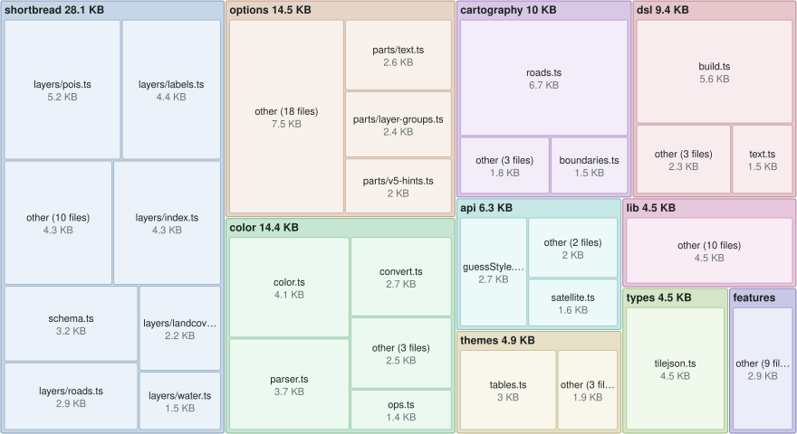

[](https://www.npmjs.com/package/@versatiles/style)
[](https://github.com/versatiles-org/versatiles-style/releases/latest)
[](https://codecov.io/gh/versatiles-org/versatiles-style)
[](https://github.com/versatiles-org/versatiles-style/actions/workflows/ci.yml)
[](LICENSE.md)

# VersaTiles Style

**VersaTiles Style** generates styles and sprites for MapLibre.

> **Upgrading from v5?** v6 is a breaking release: the palette builders (`colorful`, `shadow`, …) are
> replaced by `osm({ theme })`, options are grouped (`textScale` → `text.scale`), all 34 of
> the renamed colour keys moved under a group prefix, and both sprite sheets were renamed.
> Unknown option keys now throw, and the error names the v6 replacement.
>
> - **[Migration from v5](API_DESIGN.md#migration-from-v5)** — the full option, colour-key and type tables.
> - **[Migrating sprite ids from v5](SPRITES.md#migrating-sprite-ids-from-v5)** — `basics` → `base` and `markers` → `extras`/`icons`.
> - **[CHANGELOG](CHANGELOG.md)** — every breaking change in 6.0.0.

---

## Styles Overview

The `osm()` function renders OpenStreetMap vector tiles using one of five built-in color palettes,
each available as a light theme and a dark one (`colorful-dark`, …). `satellite()` renders raster/satellite tiles with an optional
vector overlay.

| Palette       | Preview                                                                                               |
| ------------- | ----------------------------------------------------------------------------------------------------- |
| **colorful**  |    |
| **natural**   |      |
| **muted**     |          |
| **gray**      |            |
| **toner**     |          |
| **satellite** |  |

---

## Using VersaTiles Styles

### Prebuilt Styles and Sprites

Download the assets from the [latest release](https://github.com/versatiles-org/versatiles-style/releases/latest/):

- **[styles.tar.gz](https://github.com/versatiles-org/versatiles-style/releases/latest/download/styles.tar.gz):** Contains all styles in multiple languages.
  - **Note:** These styles use `tiles.versatiles.org` as the source for tiles, fonts (glyphs), and icons (sprites).
- **[sprites.tar.gz](https://github.com/versatiles-org/versatiles-style/releases/latest/download/sprites.tar.gz):** Includes map icons and other sprites.
- **[Sprite overview](https://versatiles.org/versatiles-style/sprites.html):** every icon in all three sheets, with its sprite ID, title and aliases.
- **[versatiles-style.tar.gz](https://github.com/versatiles-org/versatiles-style/releases/latest/download/versatiles-style.tar.gz):** Contains a JavaScript file to generate styles dynamically in the browser.

---

## Generating Styles On-the-Fly

### Frontend Usage (Web Browser)

Download the latest release:

```bash
curl -Ls "https://github.com/versatiles-org/versatiles-style/releases/latest/download/versatiles-style.tar.gz" | gzip -d | tar -xf -
```

Integrate it into your HTML application:

```html
<div id="map"></div>
<script src="maplibre-gl.js"></script>
<script src="versatiles-style.js"></script>
<script>
  (async () => {
    const style = VersaTilesStyle.osm({
      theme: 'colorful-dark',
      text: { language: 'de' },
      recolor: { gamma: 0.5 },
    });

    const map = new maplibregl.Map({
      container: 'map',
      style: await VersaTilesStyle.inlineSources(style),
    });
  })();
</script>
```

> **`inlineSources` is required, not optional.** `osm()` and `satellite()` are synchronous and do no
> I/O: they leave each source as a `{ type, url }` reference to a TileJSON and let MapLibre fetch it.
> That works only if the TileJSON lists absolute tile URLs — and the VersaTiles ones list **relative**
> templates (`/tiles/osm/{z}/{x}/{y}`), which MapLibre does not resolve. Handing such a style straight
> to `new maplibregl.Map()` fails with
> `Request constructor: /tiles/osm/2/2/2 is not a valid URL` and no tiles appear.
>
> `inlineSources` fetches the TileJSON and folds it in, so the tile URLs come out absolute and the
> attribution, bounds and maxzoom it carries are preserved. That last part matters: the attribution
> is a licensing obligation.
>
> If your own tile server publishes absolute tile URLs, you can skip it and stay fully synchronous.

Everything the bundle provides is listed under
[`versatiles-style.js`](https://versatiles.org/versatiles-style/modules/versatiles-style.js.html) in the API documentation —
that page is generated from the bundle's own entry point, so it is the definitive answer to "is this
available in the browser?". The surface is smaller than the npm one on purpose: the authoring helpers
(`osm.minimizeOptions`, `osm.toCode`), the font-discovery functions, `randomColor` and the TileJSON
validators are npm-only, because a page that builds a style and hands it to MapLibre never calls them
and would otherwise download them. The shipped `versatiles-style.d.ts` carries the same list as types.

> **Requires MapLibre GL JS 5.0 or newer.**
> The generated styles set the [`globe` projection](https://maplibre.org/maplibre-style-spec/projection/)
> and a root [`sky`](https://maplibre.org/maplibre-style-spec/sky/). Older versions ignore both and
> render a flat Mercator map with no sky — everything else works, so this degrades rather than breaks.
>
> npm users have this checked automatically through an optional peer dependency. Loading MapLibre
> from a `<script>` tag, as above, bypasses that check entirely — so verify the version yourself.
> To stay on Mercator deliberately, pass `projection: 'mercator'`.

### Backend Usage (Node.js)

Install the library via NPM:

```bash
npm install @versatiles/style
```

Generate styles programmatically:

```javascript
import { osm, inlineSources } from '@versatiles/style';
import { writeFileSync } from 'node:fs';

const style = osm({
  theme: 'colorful',
  text: { language: 'en' },
});
// resolves the TileJSON reference into absolute tile URLs — see the note above
writeFileSync('style.json', JSON.stringify(await inlineSources(style)));
```

The CDN bundle exposes `osm()`, `satellite()`, `guessStyle()`, `guessSchema()`, `inlineSources()`,
`fetchTileJSON()`, `Color` and the rest of the documented API. Four things ship in the npm package
only, because they serve tooling rather than pages:

- `minimizeOptions()` and `toCode()` on `osm`/`satellite` — storing options, emitting a snippet: a
  style editor's job.
- the font-discovery helpers (`fetchFontFaces()`, `fontCovers()`, `fontScripts()`, `languageScript()`,
  `textScripts()`, `FONT_SCRIPTS`) — they serve a font picker, not a map.
- `randomColor()` — picking a colour is authoring work, and its hue dictionary costs \~1.2 KB gzipped.
- the TileJSON validators (`assertTileJSONSpecification()`, `isTileJSONSpecification()` and their
  raster counterparts) — for a tool that ingests tilesets; `guessStyle()` already validates what it
  fetches.

A `style.json` written without `inlineSources` still carries a `url` reference, so whoever loads it
hits the same relative-tile problem. This is exactly what the published styles do — `build-styles.ts`
calls `inlineSources` before writing each one.

---

## Style Generation Methods

`osm()` and `satellite()` are **synchronous** and do no I/O; `guessStyle()` is **asynchronous**,
because it has to read the TileJSON before it can decide what to build. All three return a MapLibre
`StyleSpecification` — pass it through `inlineSources` before handing it to MapLibre, as above:

- `osm(options)` - OpenStreetMap vector style. [Documentation](https://versatiles.org/versatiles-style/variables/_versatiles_style.osm.html)
  - `theme`: a palette name (`'colorful' | 'natural' | 'muted' | 'gray' | 'toner'`), or its dark theme with a `-dark` suffix (`'colorful-dark'`, …).
  - `text`: label language, scale and font — per label topic where wanted (`{ language: 'de', font: 'noto_sans_regular', pois: { general: { scale: 1.2 } } }`).
  - `icon`, `sky`, `sun`, `projection`: icon sizing, the sky block, the 3D light, and the map projection.
  - `colors`, `recolor`, `layers`, `features`, `urls`: see [OsmOptions](https://versatiles.org/versatiles-style/types/_versatiles_style.OsmOptions.html).
- `satellite(options)` - raster/satellite style with an optional OSM overlay. [Documentation](https://versatiles.org/versatiles-style/variables/_versatiles_style.satellite.html) — see [SatelliteOptions](https://versatiles.org/versatiles-style/types/_versatiles_style.SatelliteOptions.html).
- `omt(options)` and `protomaps(options)` - the same style for **OpenMapTiles** and **Protomaps Basemap** tiles, each on its own subpath. They take the same options and carry the same statics as `osm()`; only the tile source option differs (`urls.omt` / `urls.protomaps`). Kept off the root entry so a page that draws only Shortbread does not download them. [`omt`](https://versatiles.org/versatiles-style/variables/_versatiles_style_omt.omt.html) · [`protomaps`](https://versatiles.org/versatiles-style/variables/_versatiles_style_protomaps.protomaps.html) — see [Other tile schemas](API_DESIGN.md#other-tile-schemas-omt-and-protomaps).

```javascript
import { omt } from '@versatiles/style/omt';
import { protomaps } from '@versatiles/style/protomaps';

const a = omt({ theme: 'muted' });
// Protomaps ships a PMTiles archive, not a hosted endpoint, so there is no default source
const b = protomaps({ urls: { protomaps: 'pmtiles://https://example.org/planet.pmtiles' } });
```

- `guessStyle(source)` - inspect a tileset, given as a TileJSON URL or object, and return the most appropriate style. [Documentation](https://versatiles.org/versatiles-style/functions/_versatiles_style.guessStyle.html)

```javascript
import { guessStyle } from '@versatiles/style';
const style = await guessStyle(tileJSON); // or the URL of a TileJSON document

// OpenMapTiles and Protomaps tilesets need their builder passed in — otherwise they fall back to
// the inspector style, because guessStyle itself imports no schema.
import { omt } from '@versatiles/style/omt';
const omtStyle = await guessStyle(tileJSON, { schemas: [omt] });
```

- `guessSchema(tileJSON)` - recognise a vector tileset's schema (`'shortbread' | 'openmaptiles' | 'protomaps'`) from its TileJSON object, synchronously and without I/O. It reads only `vector_layers`, and scores every schema so a caller can see why. [Documentation](https://versatiles.org/versatiles-style/functions/_versatiles_style.guessSchema.html)

```javascript
import { guessSchema } from '@versatiles/style';
const guess = guessSchema(tileJSON); // { type: 'vector', schema: 'openmaptiles', candidates: [...] }
```

- `inspectorStyle(tileJSON)` - a colour-coded style drawing **every** source-layer of a vector tileset — a translucent fill, a line and a `name` label per layer, nothing filtered. For unfamiliar tiles, or for checking what a tileset actually carries rather than how it should look. Synchronous, no I/O. [Documentation](https://versatiles.org/versatiles-style/functions/_versatiles_style.inspectorStyle.html)

```javascript
import { inspectorStyle } from '@versatiles/style';
const style = inspectorStyle(tileJSON);
```

This is also what `guessStyle()` falls back to when it cannot build a tileset's schema — so if an OpenMapTiles map renders as flat translucent blobs, the `schemas` option is missing.

- `guessOptions(style)` - from `@versatiles/style/migrate`: read a MapLibre style built for OpenMapTiles, Protomaps or Shortbread tiles, and return the `osm()` or `satellite()` options whose style looks most like it — for moving a map onto VersaTiles. `deriveOptions(style, tileJSONs?, fontNames?)` is its synchronous, I/O-free core.

```javascript
import { osm } from '@versatiles/style';
import { guessOptions } from '@versatiles/style/migrate';
const guess = await guessOptions('https://example.org/my-style/style.json');
// `diff: false` because this is a rebuilt style, not an edit of the running one
if (guess.kind === 'osm') map.setStyle(osm(guess.options), { diff: false });
// `guess.report.diagnostics` says what was lost, guessed at or chosen between — each with a stable
// `code` and the option it concerns; `guess.report.provenance` says where each option came from.
```

- `fetchFontFaces(urls?)`, `fontCovers(face, language)`, `fontScripts(face)`, `languageScript(language)`, `textScripts(text)`, `FONT_SCRIPTS` and `labelLanguage(language)` - for a font picker over the `font` of each `text` topic: the faces a glyph server publishes (from its `font_families.json`), with titles; whether a face has the glyphs for a label language; which writing systems a face covers, read from the `codeblocks` in that file — a hint, not a guarantee — and which a text uses; and the language `'user'` stands for. `osm.textGroups` lists the layers each topic sets.

```javascript
import { fetchFontFaces, fontCovers, fontScripts } from '@versatiles/style';
const faces = await fetchFontFaces(); // undefined when the server publishes no list
const forGreek = faces?.filter((face) => fontCovers(face, 'el') !== false);
const forCyrillic = faces?.filter((face) => fontScripts(face).includes('Cyrl'));
```

---

## Build Instructions

### Prerequisites

To build new sprites, ensure `optipng` is installed.

### SVG Source Requirements

- SVGs must consist only of paths and should not contain any `transform()` attributes.
- Styles and colors within the SVG are ignored.
- All length values must be specified in pixels without units.

### Recommended icon sources

When adding new icons, [Pinhead Map Icons](https://pinhead.ink/) ([source](https://github.com/waysidemapping/pinhead)) is a useful starting point — a CC0-licensed collection of 1000+ cartographic SVGs designed to be legible at pin-marker scale, unifying icons from Maki, Temaki, OSM Carto, and NPMap.

### Configuration

Define icon sets in the configuration file: [`scripts/config/sprites.ts`](./scripts/config/sprites.ts)

---

## Development

Run the project in development mode:

```bash
npm run dev
```

A local server will be available at <http://localhost:8080>. Use it to select a style, edit definitions in `src/themes/...` and `src/shortbread/...`, and reload the page to view the changes.

### Bundle Composition

<!--- This chapter is generated automatically --->

[](assets/bundle-treemap.svg?raw=true)

Sized by the bundle's own sourcemap: **99.7 KB** raw, **30.2 KB** gzipped, across 83 modules.

### Dependency Graph

<!--- This chapter is generated automatically --->

[](assets/dependency-graph.svg?raw=true)

## Licenses

- **Source Code:** [MIT](./LICENSE.md)
- **Iconsets and Rendered Spritemaps:** [CC0 1.0 Universal](./icons/LICENSE.md)
