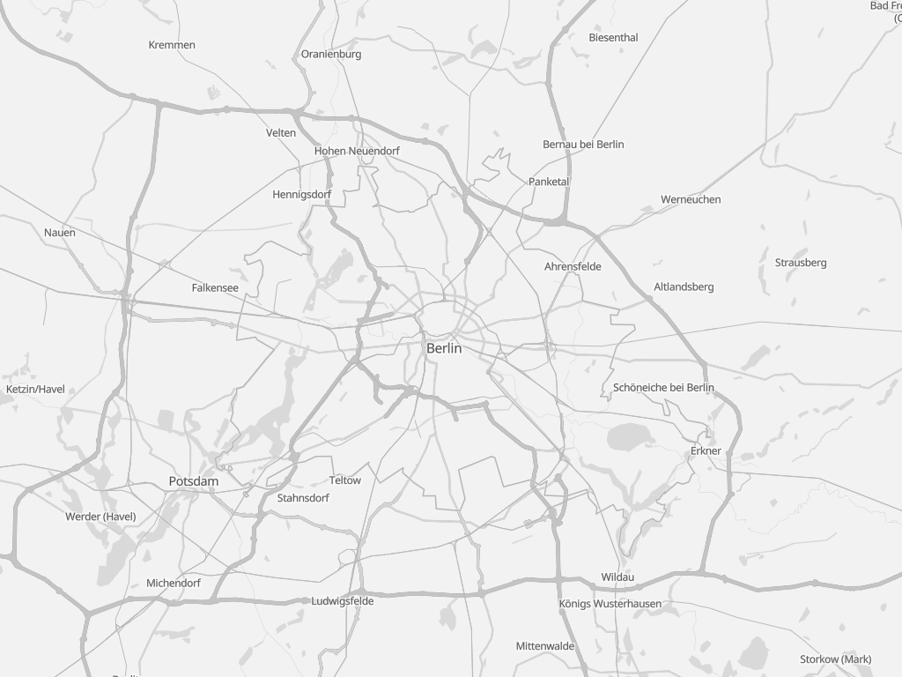

**@versatiles/style**

***

[](https://www.npmjs.com/package/@versatiles/style)
[](https://codecov.io/gh/versatiles-org/versatiles-style)
[](https://github.com/versatiles-org/versatiles-style/actions/workflows/ci.yml)
[](https://github.com/versatiles-org/versatiles-style/releases/latest)

# VersaTiles Style

Generates styles and sprites for MapLibre.

# Styles

style name | preview
-----------|--------------------------------------------------------------------------
colorful   | 
graybeard  | 
eclipse    | 
neutrino   | 

# Use styles for versatiles.org

You in the the [latest release](https://github.com/versatiles-org/versatiles-style/releases/latest/) you can find:
- [`styles.tar.gz`](https://github.com/versatiles-org/versatiles-style/releases/latest/download/styles.tar.gz) containing all styles, each in multiple languages.  
Be aware that these styles use `tiles.versatiles.org` as source for tiles, fonts (glyphs) and icons (sprites). 
- [`sprites.tar.gz`](https://github.com/versatiles-org/versatiles-style/releases/latest/download/sprites.tar.gz) containing sprites, used e.g. for map icons
- [`versatiles-style.tar.gz`](https://github.com/versatiles-org/versatiles-style/releases/latest/download/versatiles-style.tar.gz) containing a JavaScript file to generate your own style in the browser.

# Generating styles on-the-fly

## Generating styles in the frontend (web browser)

Download latest release:

```bash
curl -Ls "https://github.com/versatiles-org/versatiles-style/releases/latest/download/versatiles-style.tar.gz" | gzip -d | tar -xf -
```

Use it in:

```html
<div id="map"></div>
<script src="maplibre-gl.js"></script>
<script src="versatiles-style.js"></script>
<script>
   const style = VersaTilesStyle.graybeard({
      language: 'de',
      colors: { label: '#222' },
      recolor: { gamma: 0.5 }
   });

   const map = new maplibregl.Map({
      container: 'map',
      style
   });
</script>
```

## Generating styles in the backend (Node.js)

Install `@versatiles/style` via NPM:

```bash
npm install @versatiles/style
```

Use it in Node.js:

```javascript
import { colorful } from '@versatiles/style';
let style = colorful({
  language: 'en',
});
writeFileSync('style.json', JSON.stringify(style));
```

### Methods for generating styles

This library provides:
- `style = colorful(options);` [documentation](https://github.com/versatiles-org/versatiles-style/blob/main/docs/functions/colorful.md)
- `style = eclipse(options);` [documentation](https://github.com/versatiles-org/versatiles-style/blob/main/docs/functions/eclipse.md)
- `style = graybeard(options);` [documentation](https://github.com/versatiles-org/versatiles-style/blob/main/docs/functions/graybeard.md)
- `style = neutrino(options);` [documentation](https://github.com/versatiles-org/versatiles-style/blob/main/docs/functions/neutrino.md)

[Where `options` is an optional object](https://github.com/versatiles-org/versatiles-style/blob/main/docs/interfaces/StyleBuilderOptions.md)

### Method: `guessStyle(options)`

```javascript
const style = guessStyle(options);
```
[documentation](https://github.com/versatiles-org/versatiles-style/blob/main/docs/functions/guessStyle.md)

# Build

Please note that for building new sprites you need `optipng`.

## SVG Sources

* SVG sources should consist only of paths and not contain any `transform()`s.
* Colors and styles are ignored.
* All lengths must be in pixels without unit.

## Configuration

Iconsets can be defined in [`scripts/config-sprites.ts`](_media/config-sprites.ts)

# Licenses

* Sourcecode: [Unlicense](_media/LICENSE.md)
* Iconsets and rendered Spritemaps: [CC0 1.0 Universal](_media/LICENSE-1.md)
