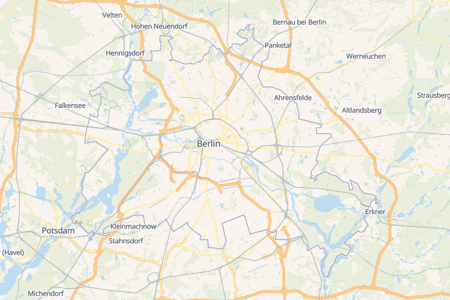

# VersaTiles Stylemaker

Programatically generate StyleJSON for Versatiles Styles.

## Styles

* [Colorful](https://tiles.versatiles.org/colorful.html) - A colorful, full featured map
* [Eclipse](https://tiles.versatiles.org/eclipse.html) - A dark basemap
* [Neutrino](https://tiles.versatiles.org/neutrino.html) - A light basemap
* Empty - An empty boilerplate style

## Generate Styles

`npm run build`

## Edit Styles

* Style definitions in `styles/*.json`
* Layer definition in `lib/layers.js`
* Style template in `lib/template.json`

## Licenses

* Code: [Unlicense](LICENSE.md)
* Styles: [CC0 1.0 Universal](https://creativecommons.org/publicdomain/zero/1.0/)
